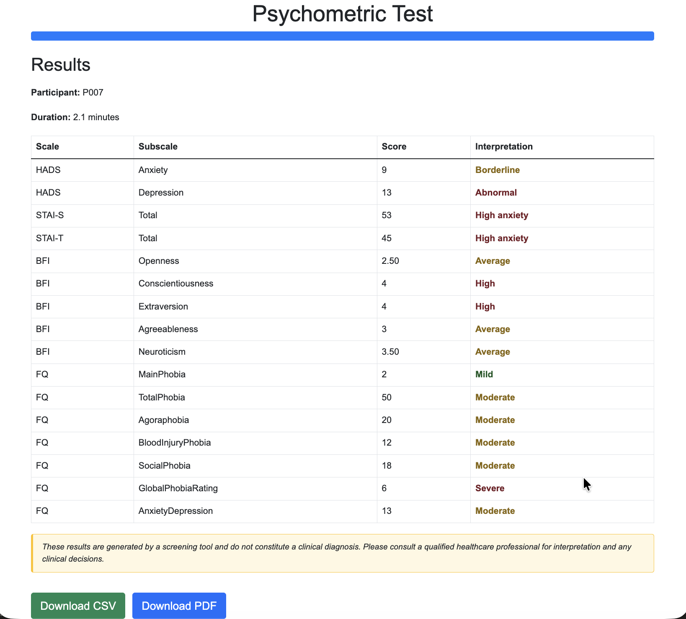
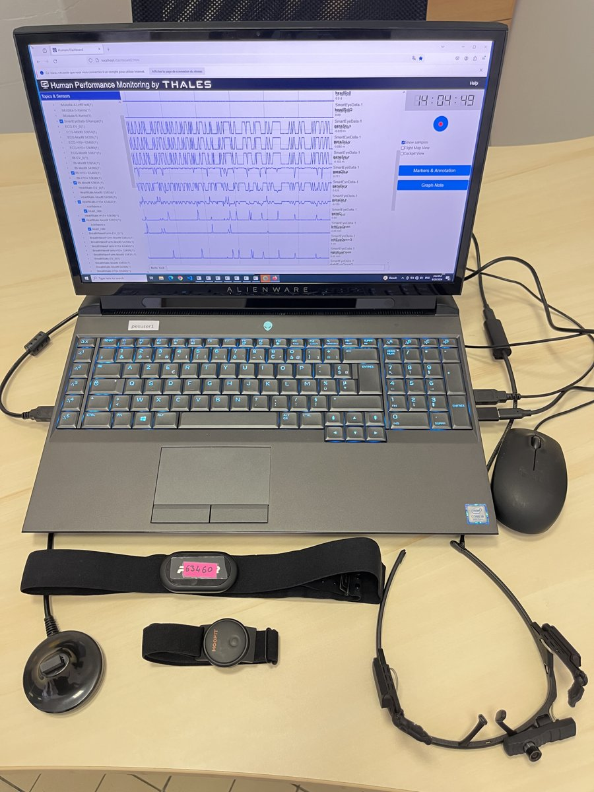
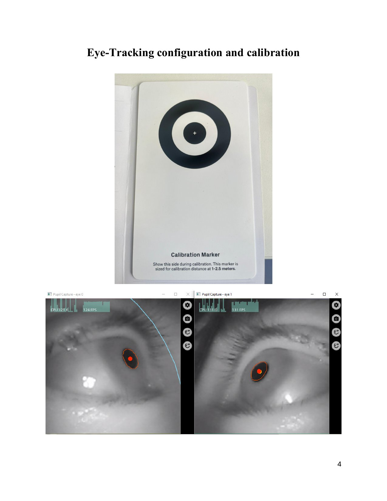
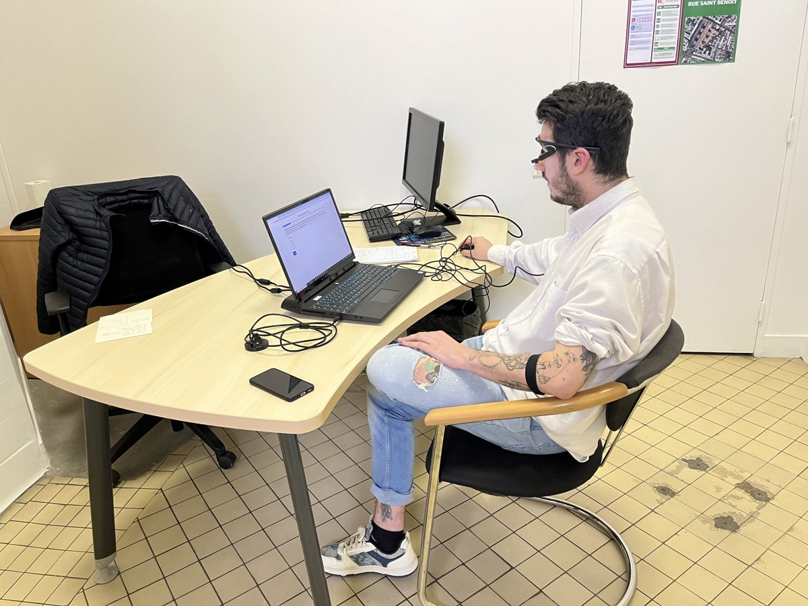
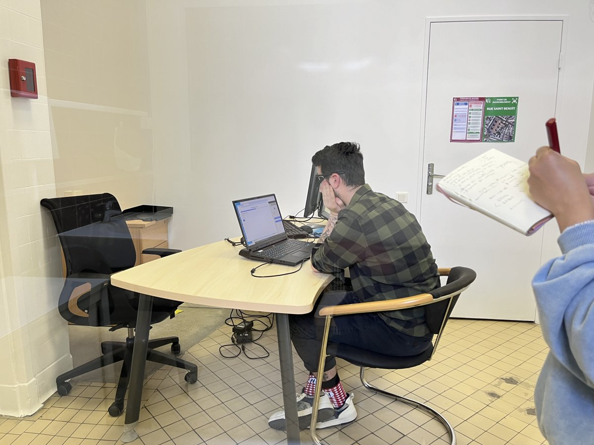
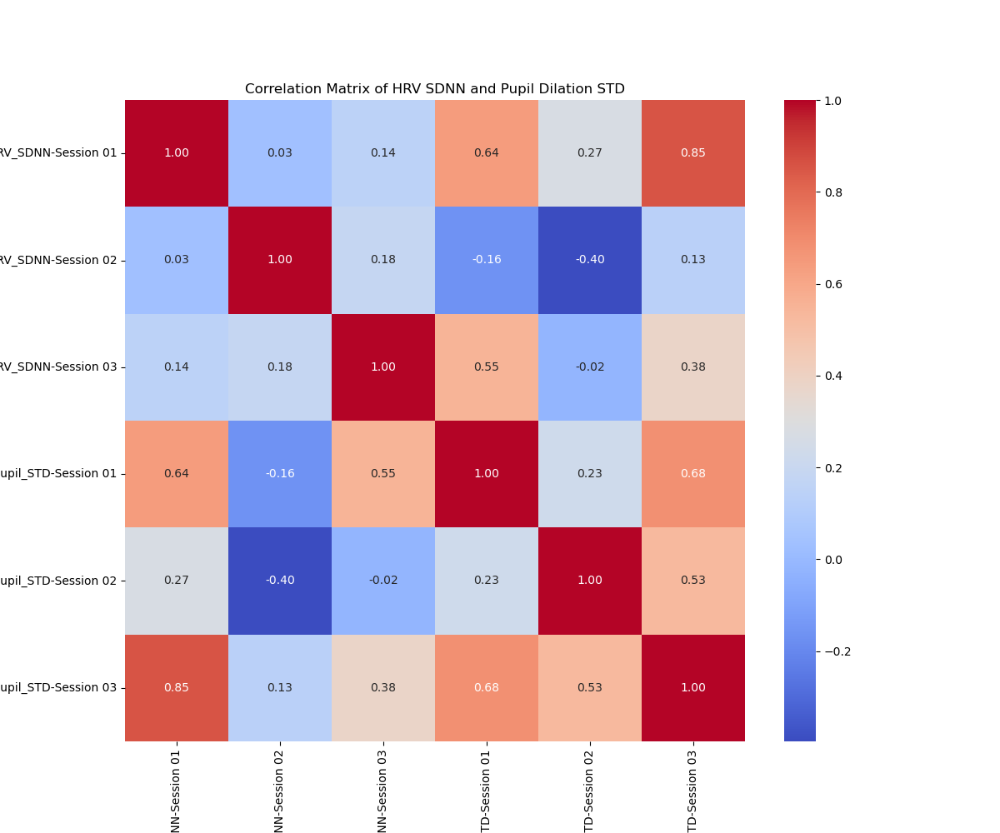
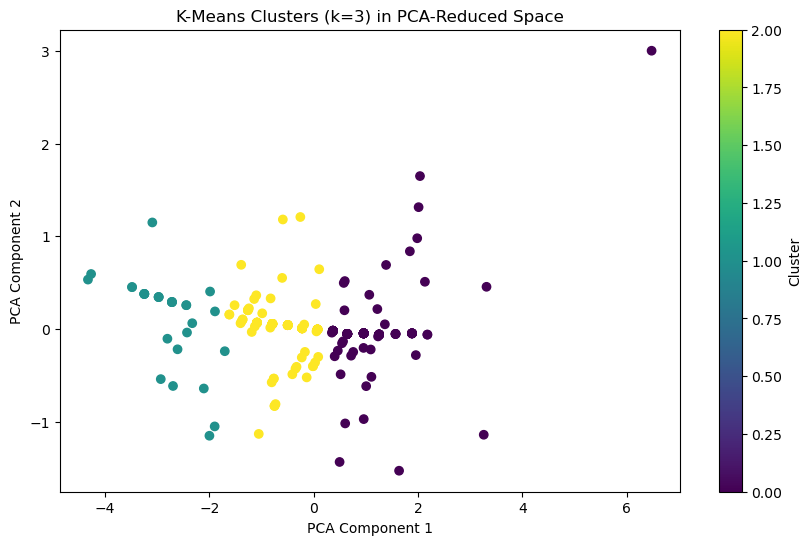
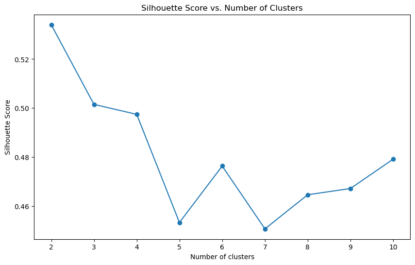

# Multimodal-Multisensor

Longitudinal study where 10 adults completed standardized psychology tests across three weekly sessions while wearing multiple biometric sensors. Combines self-report psychometric data with real-time physiological recordings.

## Study design

| Parameter | Detail |
|-----------|--------|
| Participants | 10 adults |
| Sessions | 3 per participant (weekly intervals) |
| Design | Longitudinal, within-subjects |
| Key finding | People differed a lot from each other; within-person consistency across sessions is tentative and underpowered (ICC(1) 0.22–0.61, n = 10) |

## Psychometric instruments

- **HADS** — Hospital Anxiety and Depression Scale
- **STAI-S** — State-Trait Anxiety Inventory (State subscale)
- **BFI-10** — Big Five Inventory (10-item short form)
- **Fear Questionnaire** — Marks-Mathews phobia assessment



## Sensors used

| Modality | Sensor | What it measures |
|----------|--------|------------------|
| Eye tracking | Pupil Labs Core | Gaze position, pupil dilation, fixations, saccades |
| Cardiac | Polar H10+ | Heart rate, HRV (SDNN, RMSSD), inter-beat intervals |
| Electrodermal | TEA GSR | Galvanic skin response, skin conductance level |
| Facial analysis | OpenFace | Action units, head pose, gaze direction |

## Experimental setup

| Hardware and sensors | Setup |
|:---:|:---:|
|  |  |

| Participant in session | Session in progress |
|:---:|:---:|
|  |  |

## How it was done

1. **Recruitment** — Adult participants screened and enrolled
2. **Baseline** — Resting-state sensor calibration before each session
3. **Assessment** — Psychometric tests administered while all sensors record simultaneously
4. **Data collection** — Synchronized multimodal streams captured per participant per session
5. **Analysis** — Individual and group-level correlations between self-report and physiological data

## Key findings

How stable are these patterns within a person across sessions? A test–retest reliability check (ICC(1), n = 10, 3 sessions) on the committed summaries gives:

| Measure | ICC(1) | 95% CI |
|---------|:------:|:------:|
| HRV SDNN | 0.22 | **[−0.13, 0.66]** |
| Pupil-dilation variability | 0.45 | [0.07, 0.79] |
| Response-duration variability | 0.61 | [0.25, 0.87] |

The confidence intervals are the real story: for HRV the interval **crosses zero**, meaning the data are equally consistent with negative and moderate reliability — i.e. essentially uninformative at n = 10. So the data do **not** support a strong "stable individual traits" reading; these measures look closer to session-to-session fluctuation than to reliable traits. Any stability claim should be read as tentative and underpowered. These numbers are fully reproducible — `mms.stats.icc1` recomputes them (point estimate and CI) from `data/group_results/`.



## Results

| Standard deviation of HRV (SDNN) | Standard deviation of pupil dilation |
|:---:|:---:|
|  |  |

| K-Means clusters in PCA space | Optimal cluster selection |
|:---:|:---:|
|  |  |

## Reproduce this analysis

```bash
git clone https://github.com/urme-b/Multimodal-Multisensor
cd Multimodal-Multisensor

python -m venv .venv && source .venv/bin/activate   # Python >= 3.11
pip install -e ".[dev,notebooks]"                   # deps + mms + tests + jupyterlab
# Byte-for-byte reproducible install instead (hashed lock):
#   pip install -r requirements.lock && pip install -e . --no-deps

# Regenerate the group-level summaries from committed data + reconciliation report
python pipeline/build_group_summaries.py

# Reproduce the headline reliability numbers (ICC + 95% CIs)
python -c "import mms, pandas as pd; \
m=mms.io.load_group_summary('HRV_SDNN')[['Session 01','Session 02','Session 03']].to_numpy(float); \
print(mms.stats.icc1(m))"

# Explore the notebooks
jupyter lab
```

**Suggested notebook order** (each folder is independent):
`case-study/preprocess_raw_to_csv → build_hrv → 1_hr / 1_hrv / 2_fixation → 3_clustering`,
then `group/group_analysis → group_correlation_matrix → group_correlation_heatmap`.

Shared loaders and metrics live in the [`mms/`](mms/) package (`mms.io`,
`mms.hrv`, `mms.stats`, `mms.fixation`) so notebooks import tested code instead
of re-implementing it. Reproducibility scope and known data issues are documented
in **[DATA_PROVENANCE.md](DATA_PROVENANCE.md)**.

## Reports & publications

- [Multimodal Multisensor Technical Report.pdf](Multimodal%20Multisensor%20Technical%20Report.pdf) — methods and results write-up
- [Thesis Report.pdf](Thesis%20Report.pdf) — full thesis
- [CYPSY_Poster.pdf](CYPSY_Poster.pdf) — CyberPsychology conference poster

## Tech Stack

Python · Jupyter · pandas · NumPy · SciPy · Matplotlib · Seaborn · scikit-learn

## Keywords

IoT · Machine Learning · Multimodal · Neurophysiological · Multi-Sensors · Psychometrics

## Ethics & Data

This repository contains human-subjects data (psychometric responses and physiological recordings from 10 adult participants). All participants gave written informed consent, including consent to share the data openly for research and educational use. Released records are pseudonymised — no names, contact details, dates of birth, or device identifiers — and are handled as special-category personal data under the GDPR and the French Data Protection Act. No IRB number applies; governance rests on that data-protection framework plus explicit consent. Intended for research and educational use only; do not attempt to re-identify participants. Full statement: [DATA_ETHICS.md](DATA_ETHICS.md).

## Related repos

- [Sensor](https://github.com/urme-b/Sensor) — Review of the biometric sensors used here
- [Psychometric](https://github.com/urme-b/Psychometric) — Web app for the psychometric tests used in this study
- [CalmSense](https://github.com/urme-b/CalmSense) — ML/DL stress detection from physiological signals

## License

- **Code** (notebooks, `mms/`, scripts) — [MIT](LICENSE)
- **Data** (`data/`) and figures — [CC-BY-4.0 with a no-re-identification term](DATA_LICENSE.md) (special-category health data)
