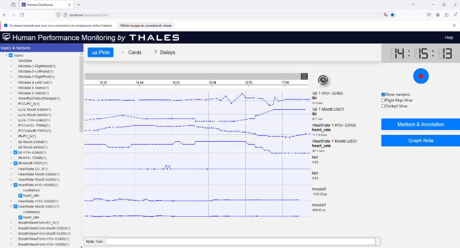
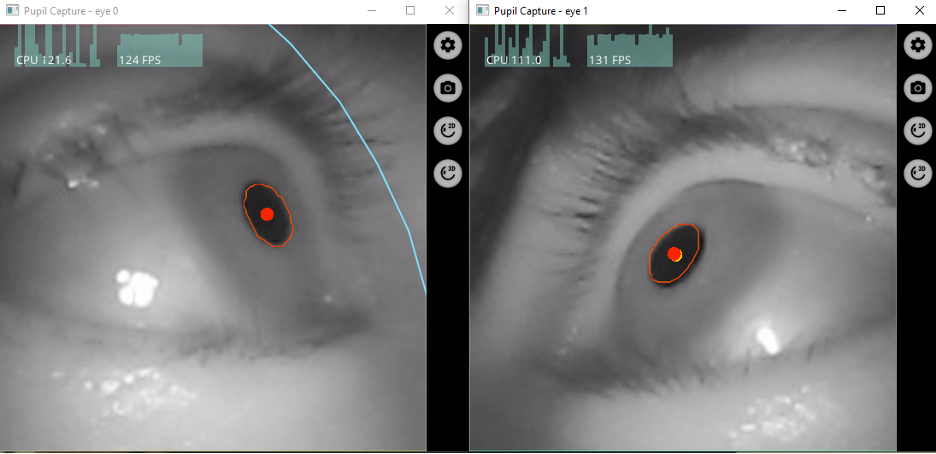
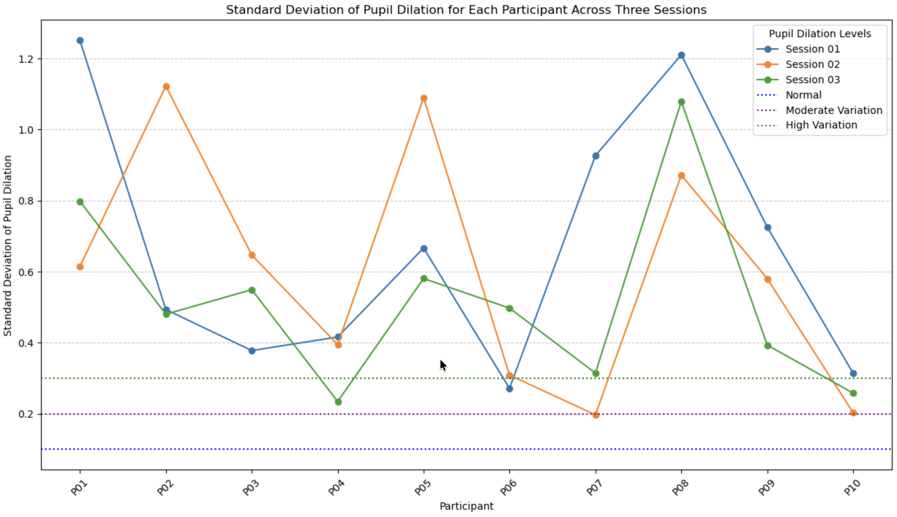
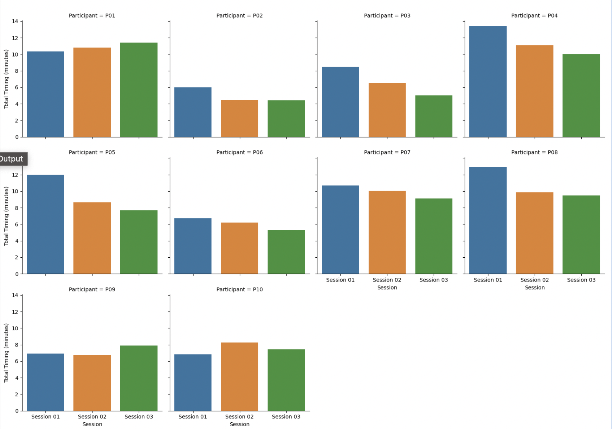

# Multimodal-Multisensor

Longitudinal study where 10 adults completed standardized psychology tests across three weekly sessions while wearing multiple biometric sensors. Combines self-report psychometric data with real-time physiological recordings.

## Study design

| Parameter | Detail |
|-----------|--------|
| Participants | 10 adults |
| Sessions | 3 per participant (weekly intervals) |
| Design | Longitudinal, within-subjects |
| Key finding | People differed a lot from each other, but each person's pattern stayed consistent across sessions |

## Psychometric instruments

- **HADS** — Hospital Anxiety and Depression Scale
- **STAI-S** — State-Trait Anxiety Inventory (State subscale)
- **BFI-10** — Big Five Inventory (10-item short form)
- **Fear Questionnaire** — Marks-Mathews phobia assessment

## Sensors used

| Modality | Sensor | What it measures |
|----------|--------|------------------|
| Eye tracking | Pupil Labs Core | Gaze position, pupil dilation, fixations, saccades |
| Cardiac | Polar H10+ | Heart rate, HRV (SDNN, RMSSD), inter-beat intervals |
| Electrodermal | TEA GSR | Galvanic skin response, skin conductance level |
| Facial analysis | OpenFace | Action units, head pose, gaze direction |

## Experimental setup

| Hardware and sensors | Eye-tracker pupil detection |
|:---:|:---:|
|  |  |

| Participant in session | Session in progress |
|:---:|:---:|
|  |  |

## How it was done

1. **Recruitment** — Adult participants screened and enrolled
2. **Baseline** — Resting-state sensor calibration before each session
3. **Assessment** — Psychometric tests administered while all sensors record simultaneously
4. **Data collection** — Synchronized multimodal streams captured per participant per session
5. **Analysis** — Individual and group-level correlations between self-report and physiological data

## Key findings

There's high variability between people (everyone responds quite differently during testing) but low variability within each person across sessions (each individual's physiological pattern stays pretty consistent). This suggests these responses reflect stable individual traits rather than just random fluctuation.

## Results

.png)

| K-Means clusters in PCA space | Optimal cluster selection |
|:---:|:---:|
|  |  |

## Tech Stack

Python · Jupyter · pandas · NumPy · SciPy · Matplotlib · Seaborn · scikit-learn

## Keywords

IoT · Machine Learning · Multimodal · Neurophysiological · Multi-Sensors · Psychometrics

## Related repos

- [Sensor](https://github.com/urme-b/Sensor) — Review of the biometric sensors used here
- [Psychometric](https://github.com/urme-b/Psychometric) — Web app for the psychometric tests used in this study
- [CalmSense](https://github.com/urme-b/CalmSense) — ML/DL stress detection from physiological signals

## License

[MIT](LICENSE)
